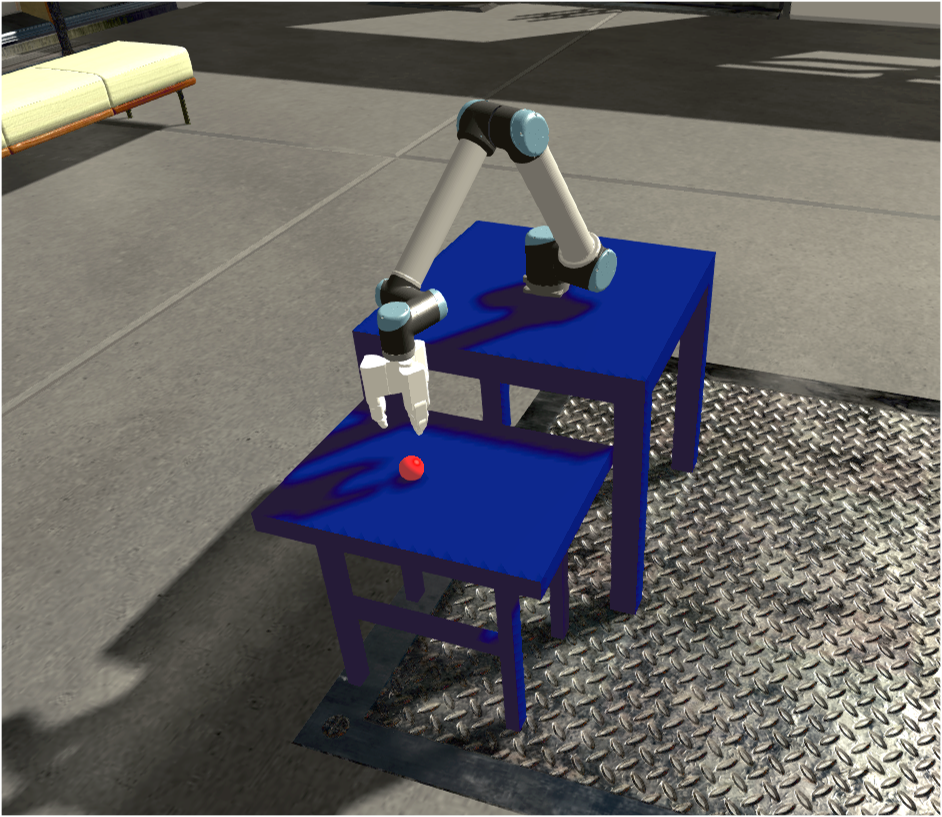

# Google Grasping Experiment in the Neurorobotics Platform
This repository contains files for a Neurorobotics Platform Experiment that aims at recreating the google grasping experiment in simulation. To get started, you need a local installation of the Neurorobotics Platform.

## Prerequisites
```
sudo apt-get install ros-kinetic-controller-manager ros-kinetic-ros-controllers ros-kinetic-moveit
```

```
pip2.7 install tensorflow keras h5py sklearn bokeh bayesian-optimization pandas
```

## Setup & Compile
```
cd google_grasping
git submodule init
git submodule update --recursive
cp resources/GazeboRosPackages/* $HBP/GazeboRosPackages/src -a
cp resources/Models/* $HBP/Models/ -a
cp resources/Experiments/* $HBP/Experiments -a
cd $HBP/Models
./create-symlinks.sh
```

```
cd $HBP/GazeboRosPackages
catkin_make
```

Adjust `GAZEBO_MODEL_PATH` and `MESH_WORKSPACE_PATH` in `smart_grasping_sandbox/launch/smart_grasping_sandbox.launch` to point to your NRP GazeboRosPackages.

## Run
1. Start the Neurorobotics Platform
  ```
  cle-start
  cle-frontend
  ```
2. Load robot description, start moveit and gazebo2moveit nodes
  ```
  roslaunch smart_grasping_sandbox smart_grasping_sandbox.launch
  ```
3. Open the shadow experiment (do not start the simulation yet)
4. Load controllers
  ```
  roslaunch fh_desc controllers.launch
  ```
5. Start simulation in NRP
6. Fire up python sample RL python script
  ```
  roscd smart_grasping_sandbox/scripts
  python RL-hand.py
  ```





The original experiment is described in detail here (https://ai.google/research/pubs/pub45450).

Information on the Neurorobotics Platform can be found here (http://www.neurorobotics.net).


