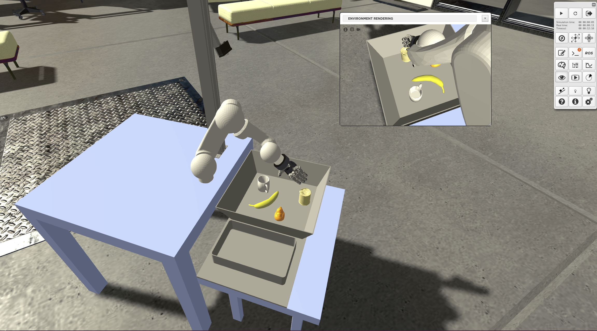

# Google Grasping Experiment in the Neurorobotics Platform
This repository contains files for a Neurorobotics Platform Experiment that aims at recreating the google grasping experiment in simulation. To get started, you need a local installation of the Neurorobotics Platform, and you have to clone this repository in ~/.opt/nrpStorage.

The original experiment is described in detail here (https://ai.google/research/pubs/pub45450).

Information on the Neurorobotics Platform can be found here (http://www.neurorobotics.net).

